# Android Root Detection Bypass Lab with Frida, Objection and Medusa

## Introduction

Ce laboratoire a pour objectif de découvrir les techniques de bypass de détection de root sur Android en utilisant plusieurs outils de dynamic instrumentation :

* Frida
* Objection
* Medusa
* ADB

Le laboratoire a été réalisé sur macOS avec un émulateur Android contenant l’application OWASP MSTG Uncrackable1.

---

# Étape 1 — Vérification de Python et pip

Cette étape consiste à vérifier que Python3 et pip3 sont correctement installés sur la machine.

## Capture 1 — Vérification de Python et pip

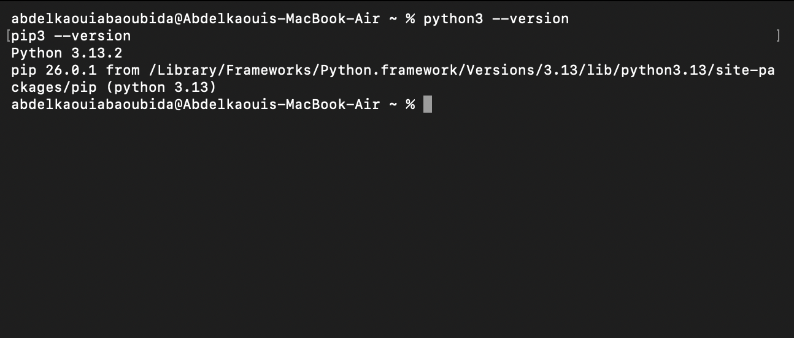

La commande suivante permet de vérifier les versions installées :

```bash
python3 --version
pip3 --version
```

---

# Étape 2 — Installation de Frida et Frida Tools

Dans cette étape, nous installons Frida ainsi que les outils nécessaires à l’instrumentation dynamique Android.

## Capture 2 — Installation de Frida

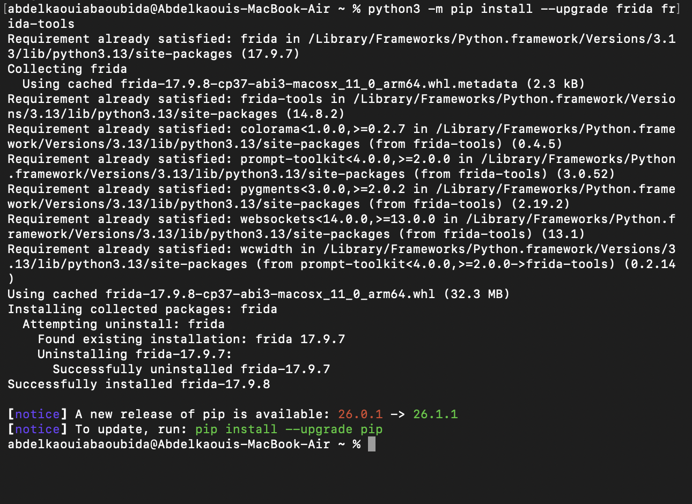

Commande utilisée :

```bash
python3 -m pip install --upgrade frida frida-tools
```

---

# Étape 3 — Vérification de l’installation de Frida

Après l’installation, il est important de vérifier que Frida fonctionne correctement.

## Capture 3 — Vérification de Frida

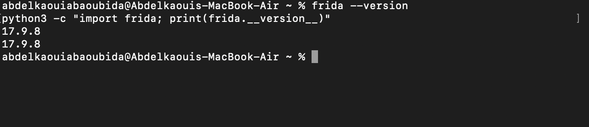

Commandes utilisées :

```bash
frida --version
python3 -c "import frida; print(frida.__version__)"
```

---

# Étape 4 — Vérification de la connexion ADB

Cette étape vérifie que l’émulateur Android est correctement détecté par ADB.

## Capture 4 — Détection de l’émulateur Android

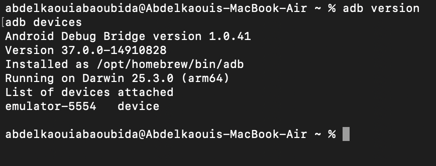

Commandes utilisées :

```bash
adb version
adb devices
```

L’émulateur apparaît avec l’état `device`, ce qui confirme que la communication fonctionne.

---

# Étape 5 — Identification de l’architecture CPU Android

Cette étape permet d’identifier l’architecture du périphérique afin de télécharger la bonne version de `frida-server`.

## Capture 5 — Architecture CPU

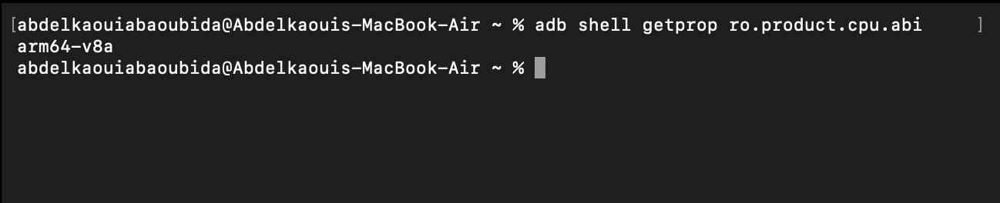

Commande utilisée :

```bash
adb shell getprop ro.product.cpu.abi
```

Résultat obtenu :

```text
arm64-v8a
```

---

# Étape 6 — Envoi de frida-server vers l’appareil Android

Le binaire `frida-server` est transféré vers l’émulateur Android.

## Capture 6 — Push de frida-server

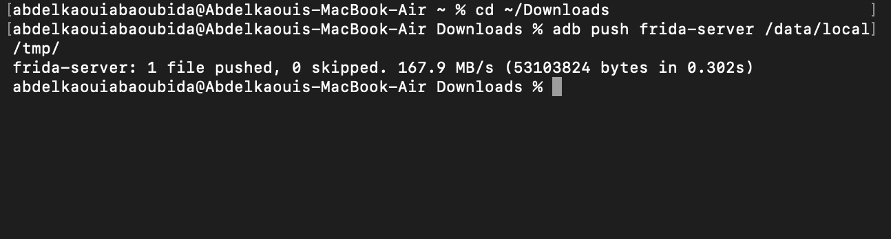

Commande utilisée :

```bash
adb push frida-server /data/local/tmp/
```

---

# Étape 7 — Démarrage de frida-server

Cette étape démarre `frida-server` sur l’appareil Android.

## Capture 7 — Lancement de frida-server

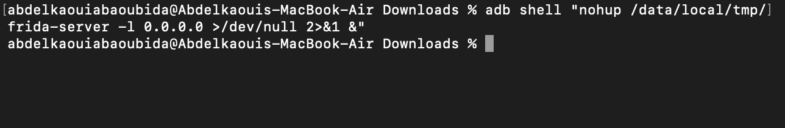

Commande utilisée :

```bash
adb shell "nohup /data/local/tmp/frida-server -l 0.0.0.0 >/dev/null 2>&1 &"
```

---

# Étape 8 — Vérification de la connexion Frida

Cette étape vérifie que Frida peut communiquer avec l’appareil Android.

## Capture 8 — Liste des applications Android

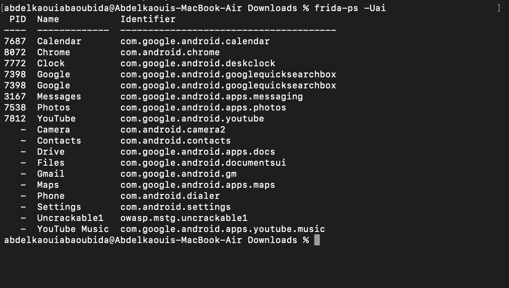

Commande utilisée :

```bash
frida-ps -Uai
```

L’application `owasp.mstg.uncrackable1` apparaît dans la liste.

---

# Étape 9 — Création du script hello.js

Un premier script Frida simple est créé afin de vérifier l’injection Java.

## Capture 9 — Création du script hello.js

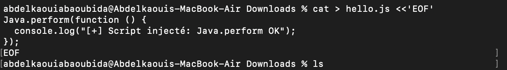

Code utilisé :

```javascript
Java.perform(function () {
  console.log("[+] Script injecté: Java.perform OK");
});
```

---

# Étape 10 — Injection du script hello.js

Cette étape teste l’injection du script Frida dans l’application Android.

## Capture 10 — Injection Frida réussie

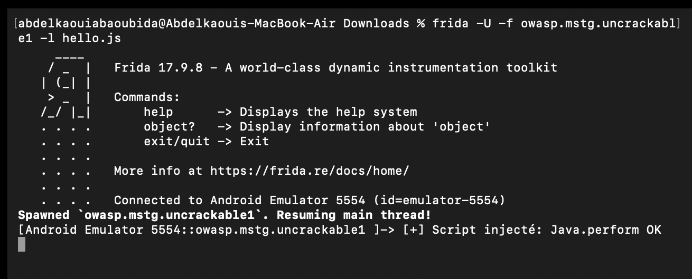

Commande utilisée :

```bash
frida -U -f owasp.mstg.uncrackable1 -l hello.js
```

Le message suivant confirme le succès :

```text
[+] Script injecté: Java.perform OK
```

---

# Étape 11 — Création du script bypass_root_basic.js

Ce script permet de contourner certaines détections de root au niveau Java.

## Capture 11 — Création du bypass Java

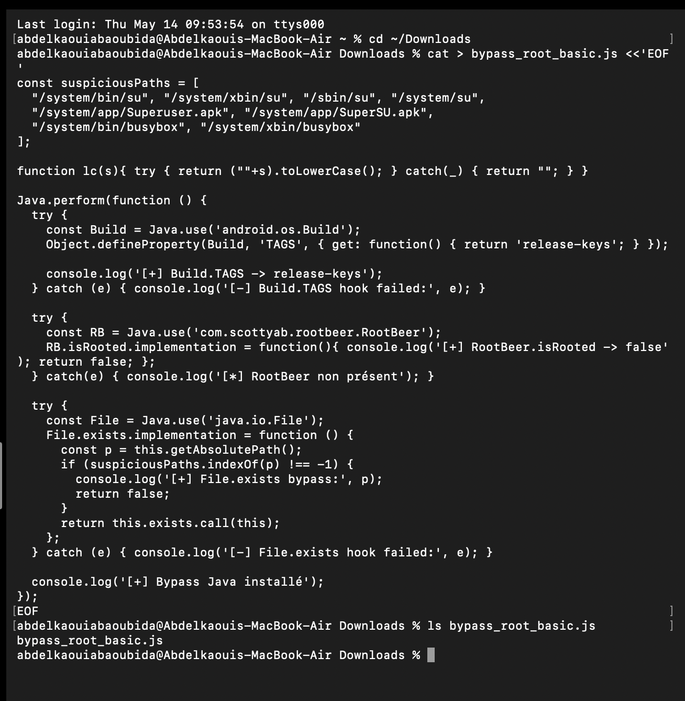

Le script modifie :

* Build.TAGS
* File.exists()
* RootBeer.isRooted()

---

# Étape 12 — Exécution du bypass Java

Cette étape injecte le script de bypass Java dans l’application.

## Capture 12 — Bypass Java fonctionnel

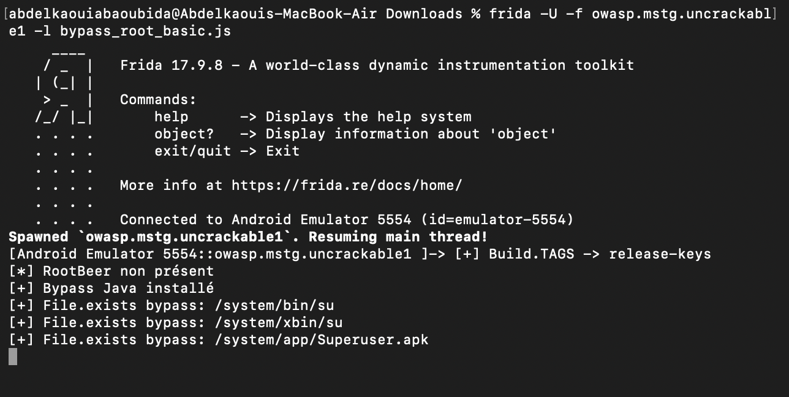

Commande utilisée :

```bash
frida -U -f owasp.mstg.uncrackable1 -l bypass_root_basic.js
```

Les logs montrent que les vérifications root sont neutralisées.

---

# Étape 13 — Création du script bypass_native.js

Un second script est créé pour bypasser certaines vérifications natives libc.

## Capture 13 — Création du bypass natif

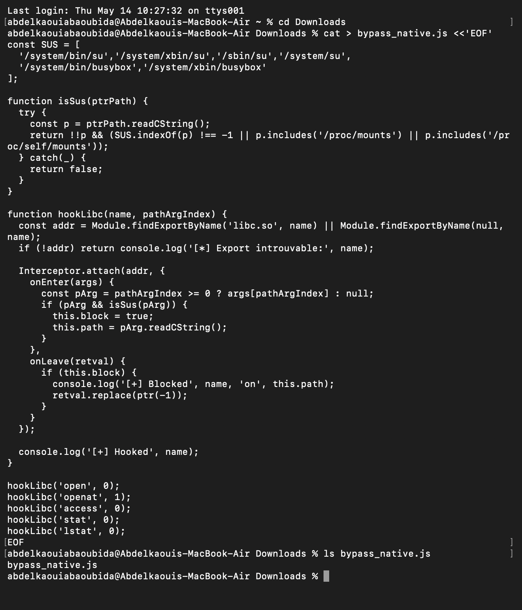

Le script hooke plusieurs fonctions libc :

* open
* openat
* access
* stat
* lstat

---

# Étape 14 — Correction et exécution du bypass natif

Après correction du script, le bypass natif fonctionne correctement.

## Capture 14 — Hooks libc actifs

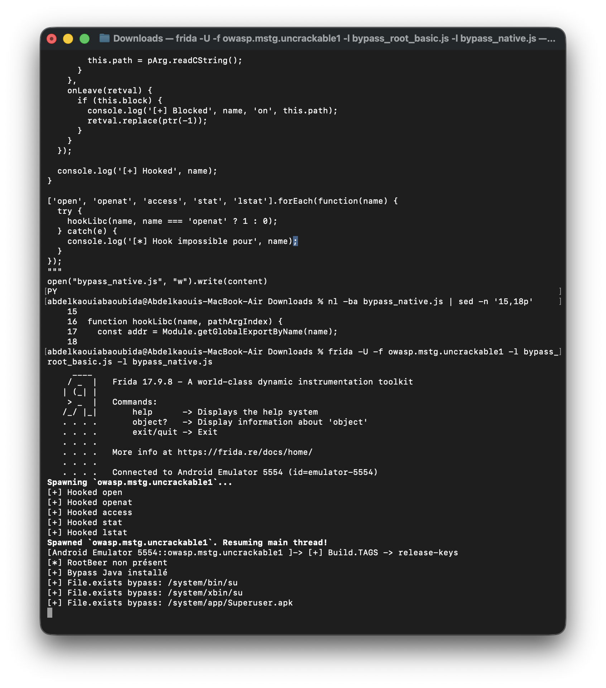

Les hooks suivants sont installés avec succès :

```text
[+] Hooked open
[+] Hooked openat
[+] Hooked access
[+] Hooked stat
[+] Hooked lstat
```

---

# Étape 15 — Vérification d’Objection

Cette étape vérifie qu’Objection est correctement installé.

## Capture 15 — Aide Objection

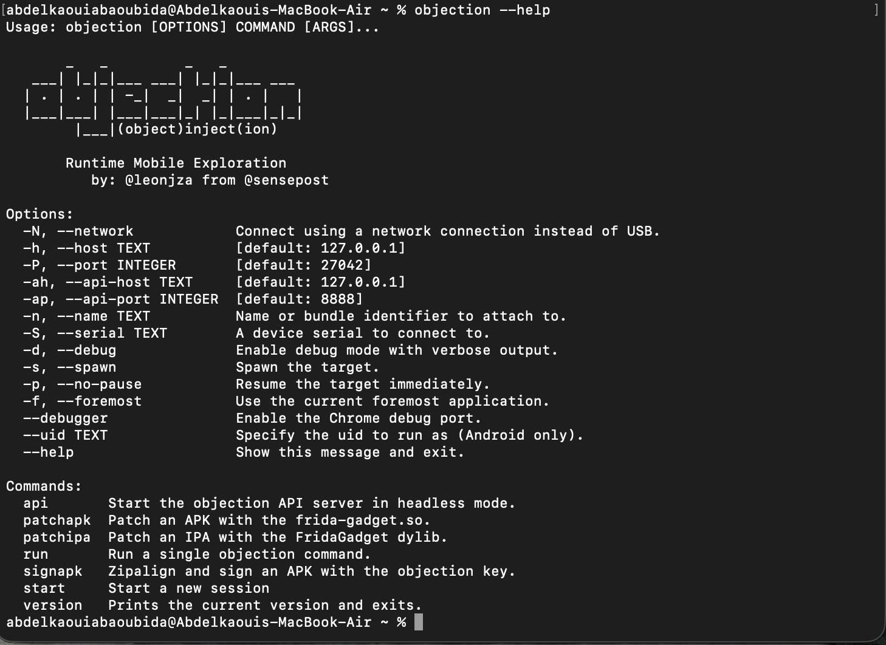

Commande utilisée :

```bash
objection --help
```

---

# Étape 16 — Bypass root automatique avec Objection

Objection permet d’automatiser certaines techniques de bypass root.

## Capture 16 — android root disable

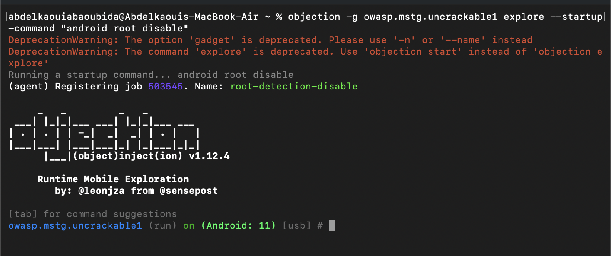

Commande utilisée :

```bash
objection -g owasp.mstg.uncrackable1 explore --startup-command "android root disable"
```

Le job `root-detection-disable` est chargé automatiquement.

---

# Étape 17 — Vérification de Git

Git est vérifié avant l’utilisation de Medusa.

## Capture 17 — Vérification de Git

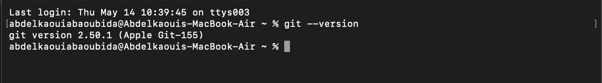

Commande utilisée :

```bash
git --version
```

---

# Étape 18 — Vérification du dossier Medusa

Le dossier Medusa est déjà présent sur la machine.

## Capture 18 — Structure du projet Medusa

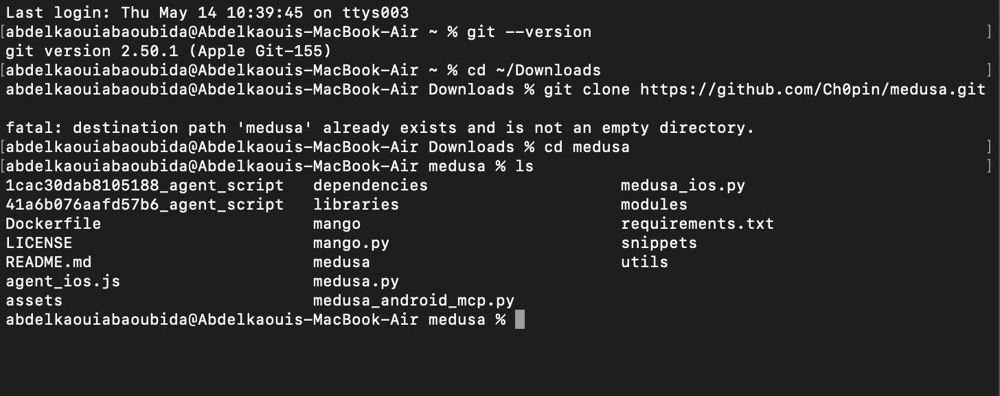

Les fichiers et dossiers principaux de Medusa sont affichés.

---

# Étape 19 — Installation des dépendances Medusa

Les dépendances nécessaires à Medusa sont installées.

## Capture 19 — Installation des requirements

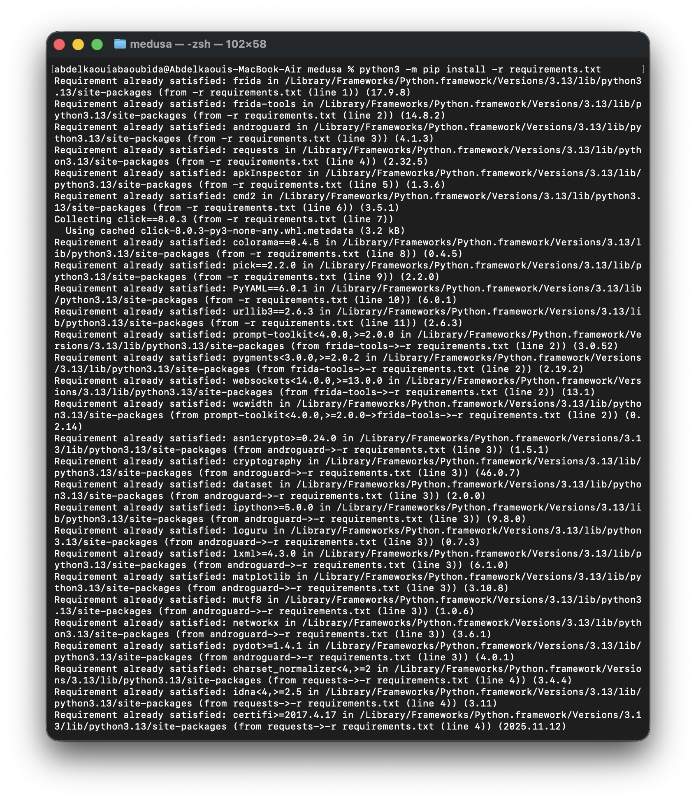

Commande utilisée :

```bash
python3 -m pip install -r requirements.txt
```

---

# Étape 20 — Vérification du fonctionnement de Medusa

Cette étape confirme que Medusa fonctionne correctement.

## Capture 20 — Help Medusa

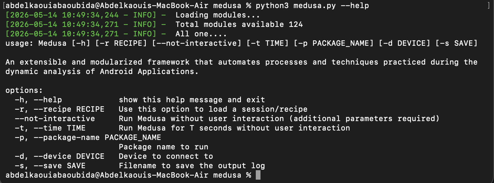

Commande utilisée :

```bash
python3 medusa.py --help
```

Les modules Medusa sont chargés correctement.

---

# Conclusion

Ce laboratoire a permis de comprendre les principales techniques de bypass de détection de root Android grâce à plusieurs outils de dynamic instrumentation.

Les objectifs réalisés sont :

* Installation et configuration de Frida
* Communication avec Android via ADB
* Injection de scripts Java avec Frida
* Bypass de détection root Java
* Bypass de détection root native libc
* Utilisation d’Objection pour automatiser le bypass
* Installation et vérification de Medusa

Ce laboratoire constitue une excellente introduction au dynamic analysis et au mobile application security testing sur Android.
